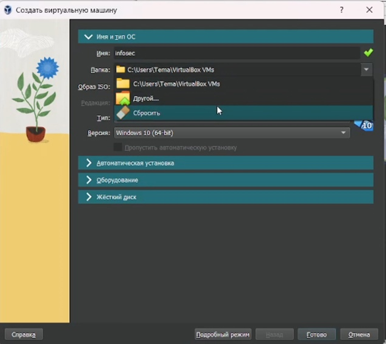
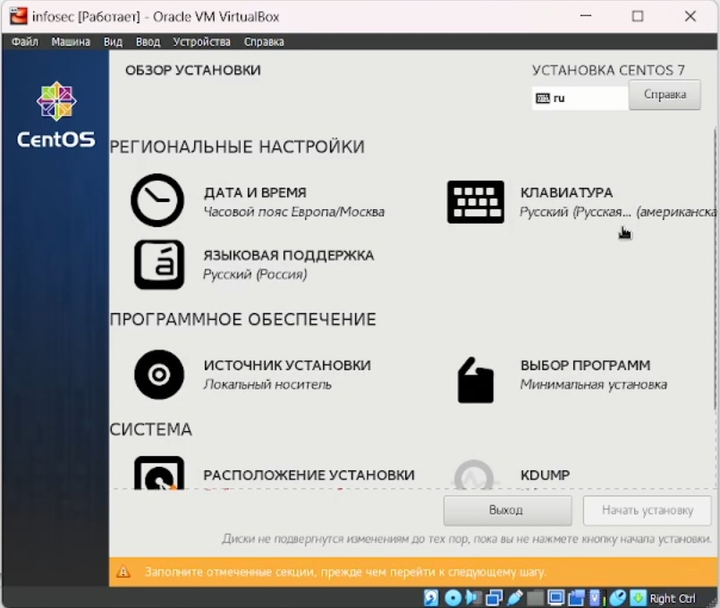
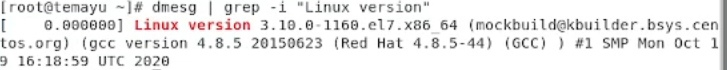
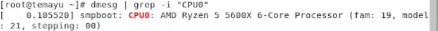
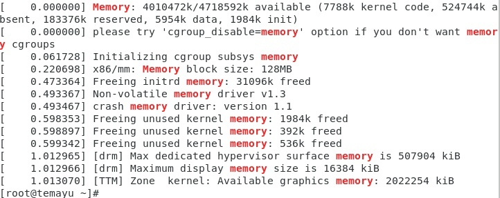
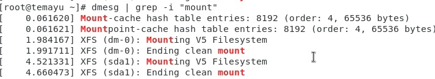

---
## Front matter
lang: ru-RU
title: Лабораторная работа № 1
author:
  - Юрченко Артём Алексеевич
group:
  - НФИбд-02-20, 1032201660
date: 2023, Москва

## i18n babel
babel-lang: russian
babel-otherlangs: english

## Fonts
mainfont: PT Serif
romanfont: PT Serif
sansfont: PT Sans
monofont: PT Mono
mainfontoptions: Ligatures=TeX
romanfontoptions: Ligatures=TeX
sansfontoptions: Ligatures=TeX,Scale=MatchLowercase
monofontoptions: Scale=MatchLowercase,Scale=0.9

## Formatting pdf
toc: false
toc-title: Содержание
slide_level: 2
aspectratio: 169
section-titles: true
theme: metropolis
header-includes:
 - \metroset{progressbar=frametitle,sectionpage=progressbar,numbering=fraction}
 - '\makeatletter'
 - '\beamer@ignorenonframefalse'
 - '\makeatother'
---

## Цели

Целью данной работы является приобретение практических навыков
установки операционной системы на виртуальную машину, настройки минимально необходимых для дальнейшей работы сервисов.

## Задачи

Установить и настроить ОС Linux на виртуальную машину.

## Ход работы

Создадим виртуальную машину.

{#fig:001 width=80%}

## Ход работы

Запустим виртуальную машину и дождемся загрузки ОС. После этого проведем первичную настройку системы

{#fig:002 width=50%}

## Ход работы

После запуска ОС откроем терминал и выведем некоторую информацию о нашей конфигурации.

{#fig:003 width=60%}

{#fig:004 width=60%}

{#fig:005 width=60%}

## Ход работы

{#fig:006 width=70%}

## Ход работы

{#fig:007 width=90%}

{#fig:008 width=90%}

## Ход работы

{#fig:009 width=90%}

## Ход работы

## Результаты

Были приобретены практические навыки установки операционной системы на виртуальную машину, настройки минимально необходимых для дальнейшей работы сервисов.
