---
## Front matter
title: "Отчет по лабораторной работе №2"
subtitle: "Дискреционное разграничение прав в Linux. Основные атрибуты"
author: "Юрченко Артём Алексеевич"

## Generic otions
lang: ru-RU
toc-title: "Содержание"

## Bibliography
bibliography: bib/cite.bib
csl: pandoc/csl/gost-r-7-0-5-2008-numeric.csl

## Pdf output format
toc: true # Table of contents
toc-depth: 2
lof: true # List of figures
lot: true # List of tables
fontsize: 12pt
linestretch: 1.5
papersize: a4
documentclass: scrreprt
## I18n polyglossia
polyglossia-lang:
  name: russian
  options:
	- spelling=modern
	- babelshorthands=true
polyglossia-otherlangs:
  name: english
## I18n babel
babel-lang: russian
babel-otherlangs: english
## Fonts
mainfont: PT Serif
romanfont: PT Serif
sansfont: PT Sans
monofont: PT Mono
mainfontoptions: Ligatures=TeX
romanfontoptions: Ligatures=TeX
sansfontoptions: Ligatures=TeX,Scale=MatchLowercase
monofontoptions: Scale=MatchLowercase,Scale=0.9
## Biblatex
biblatex: true
biblio-style: "gost-numeric"
biblatexoptions:
  - parentracker=true
  - backend=biber
  - hyperref=auto
  - language=auto
  - autolang=other*
  - citestyle=gost-numeric
## Pandoc-crossref LaTeX customization
figureTitle: "Рис."
tableTitle: "Таблица"
listingTitle: "Листинг"
lofTitle: "Список иллюстраций"
lotTitle: "Список таблиц"
lolTitle: "Листинги"
## Misc options
indent: true
header-includes:
  - \usepackage{indentfirst}
  - \usepackage{float} # keep figures where there are in the text
  - \floatplacement{figure}{H} # keep figures where there are in the text
---

# Цель работы

### Целью данной работы является Получение практических навыков работы в консоли с атрибутами файлов, закрепление теоретических основ дискреционного разграничения доступа в современных системах с открытым кодом на базе ОС Linux
---
# Ход работы
1. В установленной при выполнении предыдущей лабораторной работы операционной системе создал учётную запись пользователя guest (используя учётную запись администратора) (рис. @fig:001)
   
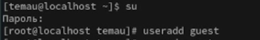{#fig:001 width=70%}

2. Задал пароль для пользователя guest (используя учётную запись администратора)(рис. @fig:002)

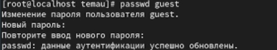{#fig:002 width=70%}

3. Вошёл в систему от имени пользователя guest.
4. Определил директорию, в которой нахожусь, командой pwd. Определил, что она является домашней (рис. @fig:003) 

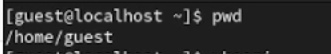{#fig:003 width=70%}

5. Уточнил имя пользователя командой whoami (рис. @fig:004)
   
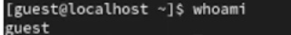{#fig:004 width=70%}

6. Уточнил имя пользователя, его группу, а также группы, куда входит пользователь, командой id. (рис. @fig:005)

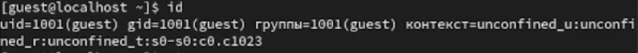{#fig:005 width=70%}

7. Сравнил вывод id с выводом команды groups. Выяснил, что на эту команду выводить только имя пользователя (рис. @fig:006)
   
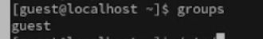{#fig:006 width=70%}

8. Просмотрел файл /etc/passwd командой cat и найшел в нем свою учетную запись. Определил uid, gid пользователя. Сравнил найденные значения с полученными в предыдущих пунктах. Они совпали.(рис. @fig:007)
   
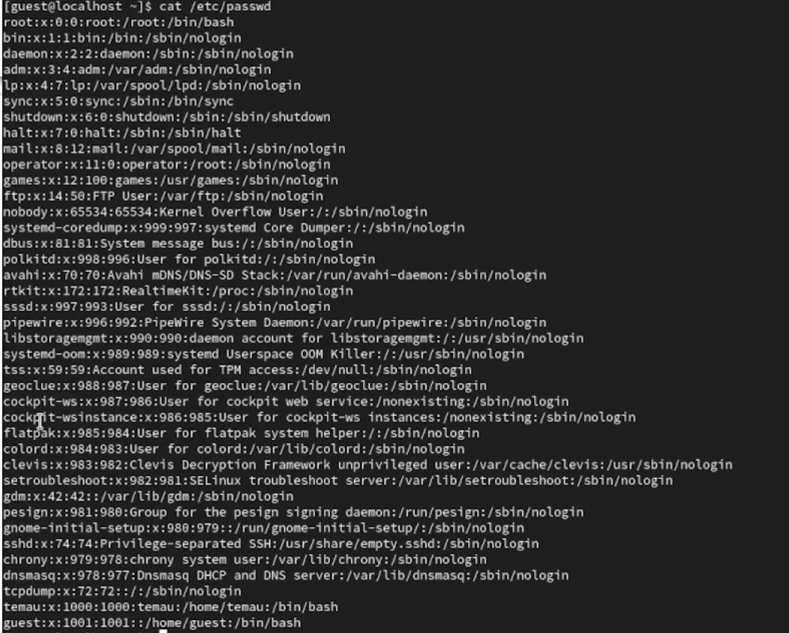{#fig:007 width=70%}

9. Определил существующие в системе директории командой ls -l /home/ (рис. @fig:008)
   
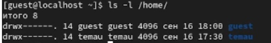{#fig:008 width=70%}

10. Проверил, какие расширенные атрибуты установлены на поддиректориях, находящихся в директории /home, командой:
lsattr /home (рис. @fig:009). Так как данные права есть у администратора, информацию получить не удалось.
   
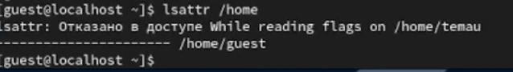{#fig:009 width=70%}

11. Создал в домашней директории поддиректорию dir1 командой mkdir dir1 
Определил командами ls -l (рис. @fig:010) и lsattr (рис. @fig:011), какие права доступа и расширенные атрибуты были выставлены на директорию dir1.
   
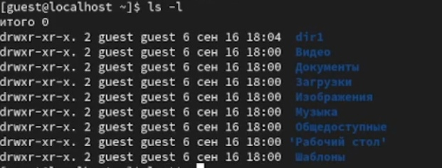{#fig:010 width=70%}

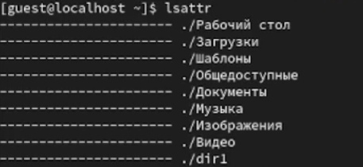{#fig:011 width=70%}

12. Снял с директории dir1 все атрибуты командой chmod 000 dir1 и проверил с её помощью правильность выполнения команды
ls -l (рис. @fig:012)
   
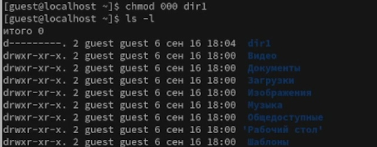{#fig:012 width=70%}

13. Попытался создать в директории dir1 файл file1 командой
echo "test" > /home/guest/dir1/file1 (рис. @fig:013)
   
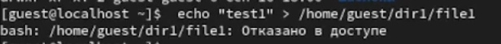{#fig:013 width=70%}

14. Заполнил таблицу «Установленные права и разрешённые действия», выполняя действия от имени владельца директории (файлов), определив опытным путём, какие операции разрешены, а какие нет.
Если операция разрешена, записал в таблицу знак «+», если не разрешена, знак «-».

 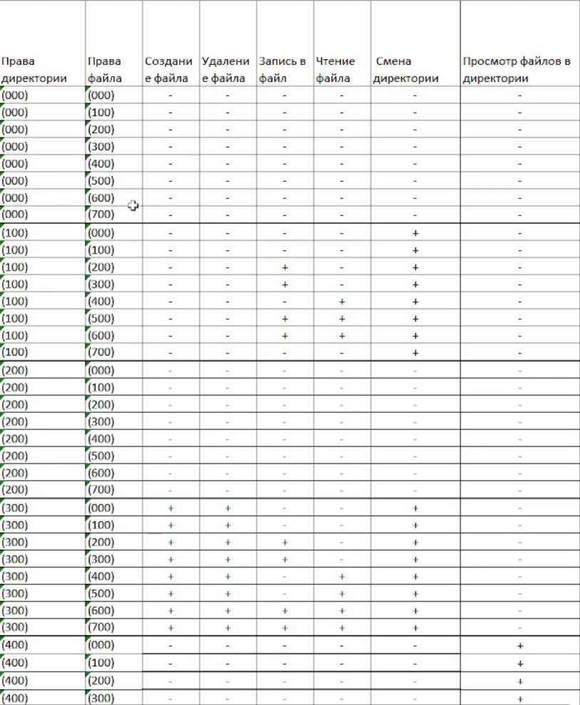{#fig:10 width=100%}

 15. На основании заполненной выше таблицы определил те или иные минимально необходимые права для выполнения операций внутри директории
dir1, заполнил следующую таблицу:

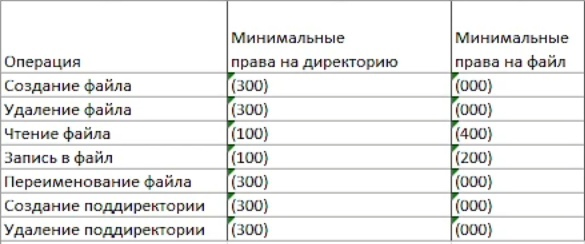{#fig:11 width=100%}

---
# Вывод
### Я получил практические навыки работы в консоли с атрибутами файлов, закрепил теоретические основы дискреционного разграничения доступа в современных системах с открытым кодом на базе ОС Linux.
---
# Библиография
### Методические материалы https://esystem.rudn.ru/pluginfile.php/2090273/mod_resource/content/6/002-lab_discret_attr.pdf